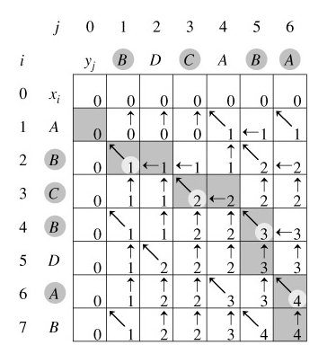

# 77. Longest Common Subsequence

- **Description**
    - Given two strings, find the **longest common subsequence** (LCS).
    - Your code should return the length of LCS.
- **Clarification**
    - What's the definition of Longest Common Subsequence?
        - [https://en.wikipedia.org/wiki/Longest_common_subsequence_problem](https://en.wikipedia.org/wiki/Longest_common_subsequence_problem)
        - [http://baike.baidu.com/view/2020307.html](http://baike.baidu.com/view/2020307.html)
- **Example**
    - For `"ABCD"` and `"EDCA"`, the LCS is `"A"` (or `"D"`, `"C"`), return `1`.
    - For `"ABCD"` and `"EACB"`, the LCS is `"AC"`, return `2`.


## Solution

### Dynamic Programming

用 DP 可以解决这个问题, Longest Common Subsequence 可以不是 continuous 的，而 Longest Common Substring 是一定要连着的

- [Longest Common Subsequence by Tushar](https://www.youtube.com/watch?v=NnD96abizww)
- [动态规划解最长公共子序列问题](https://blog.csdn.net/yysdsyl/article/details/4226630)





```java
public class Solution {
    /**
     * @param A: A string
     * @param B: A string
     * @return: The length of longest common subsequence of A and B
     */
    public int longestCommonSubsequence(String A, String B) {
        // write your code here
        if (A == null || B == null || A.length() == 0 || B.length() == 0) {
            return 0;
        }

        int lengthA = A.length();
        int lengthB = B.length();

        int[][] arr = new int[lengthB + 1][lengthA + 1];
        for (int j = 1; j <= lengthB; j++) {
            for (int i = 1; i <= lengthA; i++) {
                if (A.charAt(i - 1) == B.charAt(j - 1)) {
                    arr[j][i] = arr[j - 1][i - 1] + 1;
                } else {
                    arr[j][i] = Math.max(arr[j][i - 1], arr[j - 1][i]);
                }
            }
        }

        return arr[lengthB][lengthA];
    }

}

```